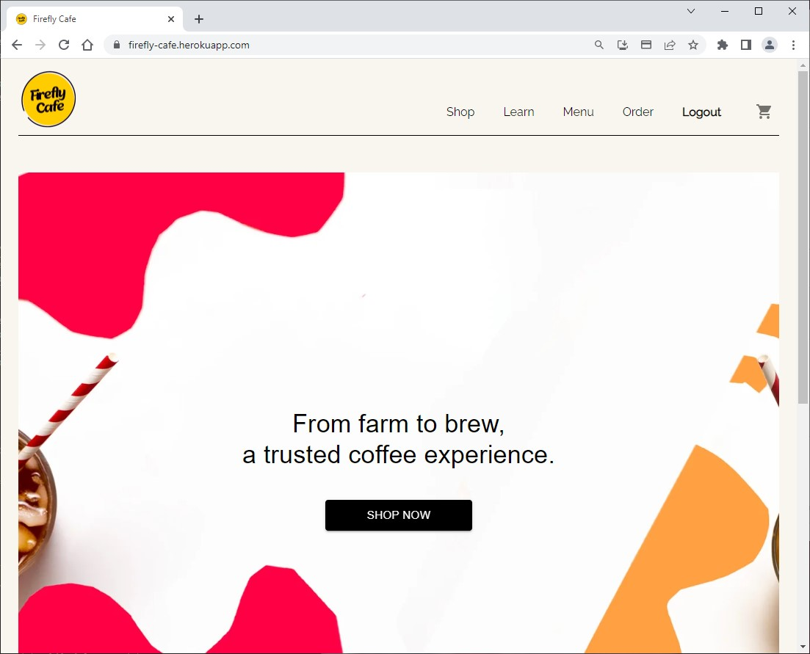
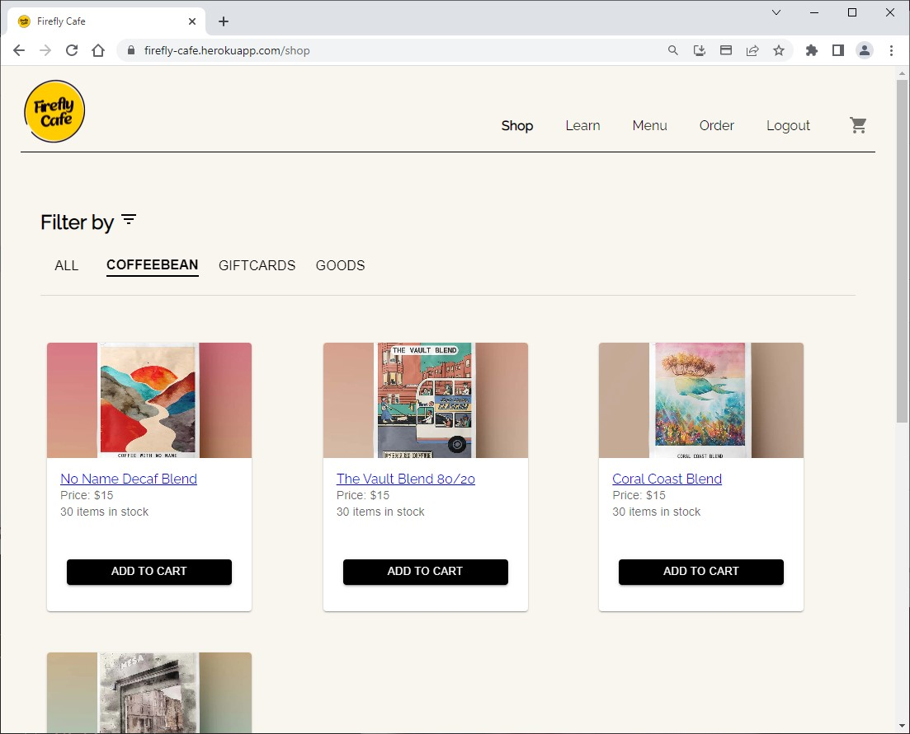
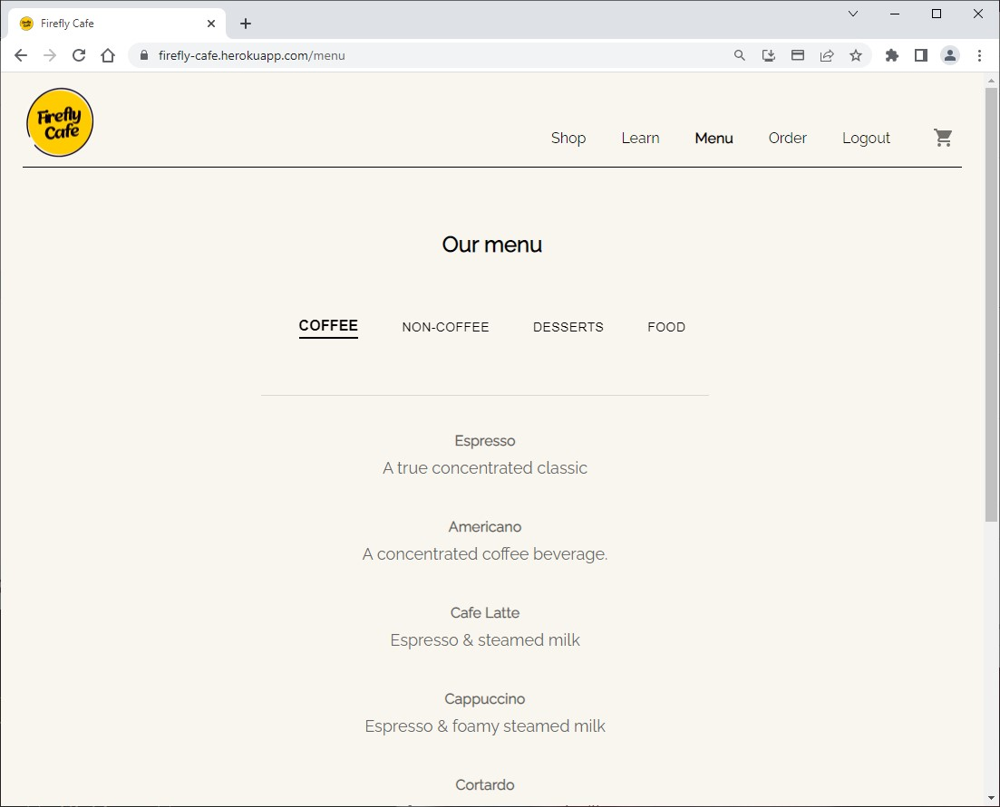
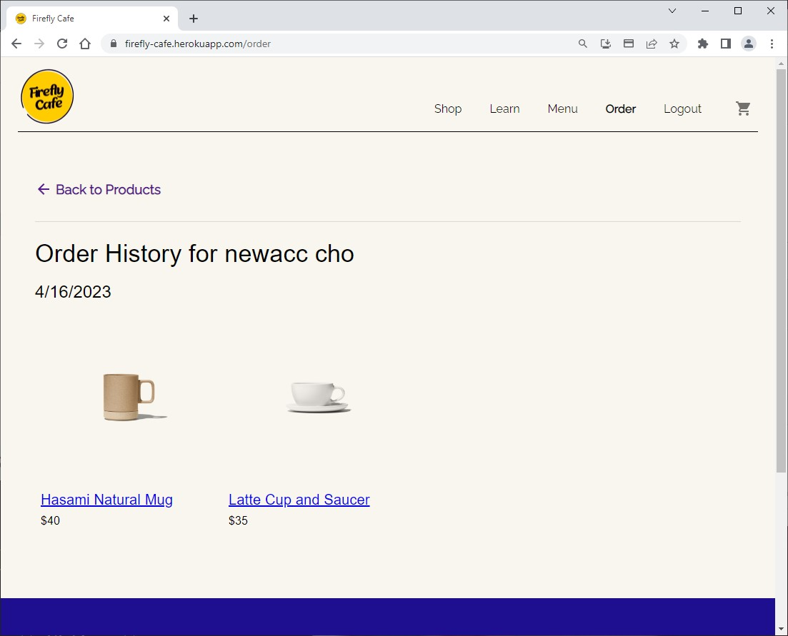

# Firefly Cafe

    
    
    
    

## Description

Firefly Cafe is a Full Stack e-commerce website for a fictional cafe. This application was built for cafe's that want to reach out to their locals with a delivery service. 

The Application was built using the following tools:

- Express.js
- mongoDB
- graphql
- Stripe
- MUI
- React

## Table of Contents 🔍
* [Installation](#installation)
* [Usage](#usage)
* [Questions](#questions)
* [License](#license)

## User Story ✉️
~~~
AS a coffee lover for a specific brand
I WANT to order coffee from the comfort of my home, office, etc.
SO THAT I can enjoy my coffee whenever and wherever
AS a cafe owner
I WANT to reach out to many customers online
SO THAT I can broaden my range of customers offline and online
~~~
## Acceptance Criteria 📩
~~~
GIVEN a website of the cafe
WHEN I visit the site
THEN I am presented with the homepage where I can shop for coffee, beans, food, and dessert
WHEN I click join
THEN I am taken to the register page
WHEN I click login
THEN I can login with the information I registered with
WHEN I click shop
THEN I can add what I want to the cart
WHEN I toggle cart, I must login to checkout
THEN I can click checkout and I am directed to a Stripe generated checkout page
WHEN I checkout is successful
THEN I am directed back to the site
WHEN I click order
THEN I am able to check my order history by date
WHEN I click on the menu
THEN I can scroll through variety of menu's with different categories
WHEN I add products to my cart but not checkout
THEN I am able to come back later to checkout whenever I want
~~~

## Installation
To run a local development copy, you must have installed Node.js, and Mongo DB.

Clone the repository, then run npm run install in the root directory of the repository. It is also recommended for you to run npm run seed in order to seed your mongo database with some example data.

Once those are done, you can see the development environemnt by running npm run develop in the root directory. This will start two Node.js servers, one running react, the other running an express server that uses Apollo Graphql to serve as the back end. They are on `localhost:3000/graphql` and `localhost:3001` respectively.

## Usage
Our application is deployed live using heroku!
Live Deploy: <a href=https://firefly-cafe.herokuapp.com>https://firefly-cafe.herokuapp.com/</a>

## License
MIT License

## Contributors
- [Minjae Cho](https://github.com/slchld1)
- [Olivia Seonyeong Lee](https://github.com/oliviasylee)
- [Jairo Macassi](https://github.com/)

## Questions ❓
For any additional questions, please reach out to: jaecho203@gmail.com, oliviasylee@gmail.com or visit [slchld1](https://github.com/slchld1), [oliviasylee](https://github.com/oliviasylee) on GitHub! Thank you.